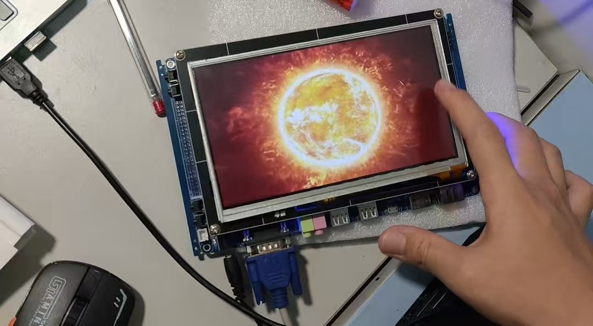

# 基于Linux的触摸屏电子相册

## 项目预览


## 项目职责
* 通过Linux Framebuffer机制，mmap内存映射，调用文件IO函数**在开发板上显示图片**
* 利用Linux输入子系统，捕获解析struct input_event，**实现基于坐标判别的触摸交互**
***
**本项目是一个典型的三层嵌入式GUI应用**
* **硬件层**：LCD显示设备，触摸屏
* **Linux内核层**：通过设备文件(/dev/fb0, /dev/input/event0)暴露硬件接口
* **应用层**：直接操作底层设备的C语言程序

本项目开发环境为VM虚拟机下使用Ubuntu，使用SecureCRT实现数据的串口传输

其中串口传输命令为```rx 上传的文件名```，后把传输文件拖至CRT窗口，等待发送完成即可，也可以在X/Y/Zmodem修改串口发送速度

## 关于图片显示
LCD显示屏为**800*480像素**，开发板LCD设备文件路径(/dev/fb0)

一切皆文件：
Linux对数据文件(*.mp3、*.bmp)，程序文件(*.c、*.h、*.o)，设备文件（LCD、触摸屏、鼠标），网络文件( socket ) 等的管理都抽象为文件，使用统一的方式方法管理；
Linux系统把每个设备都映射成一个文件，这就是设备文件。它是用于向I/O设备提供连接的一种文件，分为字符设备和块设备文件；
字符设备的存取以一个字符为单位，块设备的存取以字符块为单位。每一种I/O设备对应一个设备文件，存放在/dev目录中，如行式打印机对应/dev/lp，第一个软盘驱动器对应/dev/fd0；

在Ubuntu上编写代码，编写好代码后，在Ubuntu上交叉编译，把Ubuntu上交叉编译生产的可执行文件通过CRT上传到开发板，在开发板上执行可执行文件

